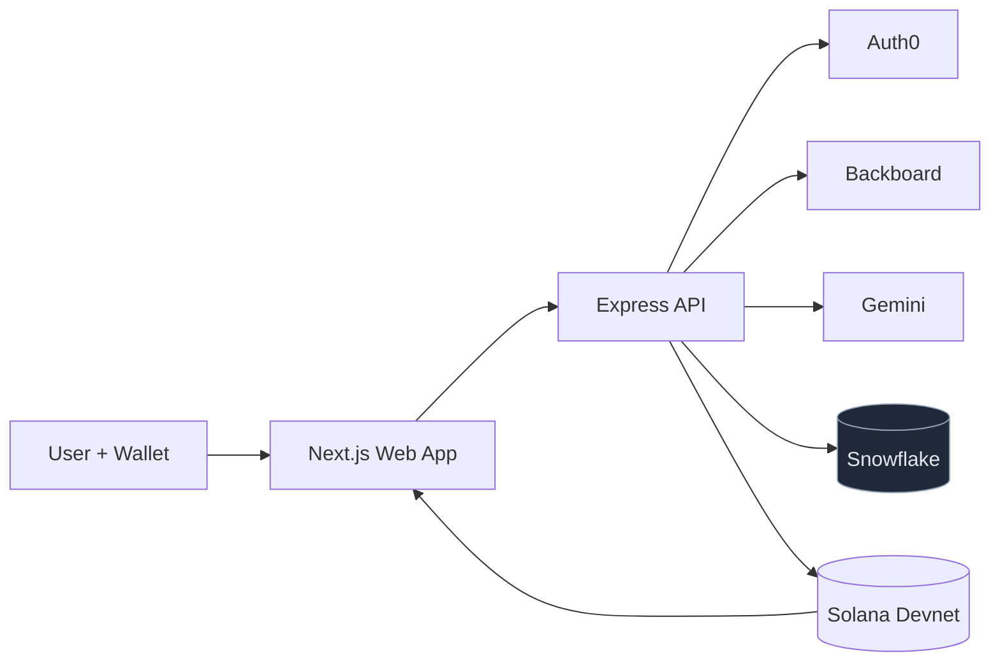
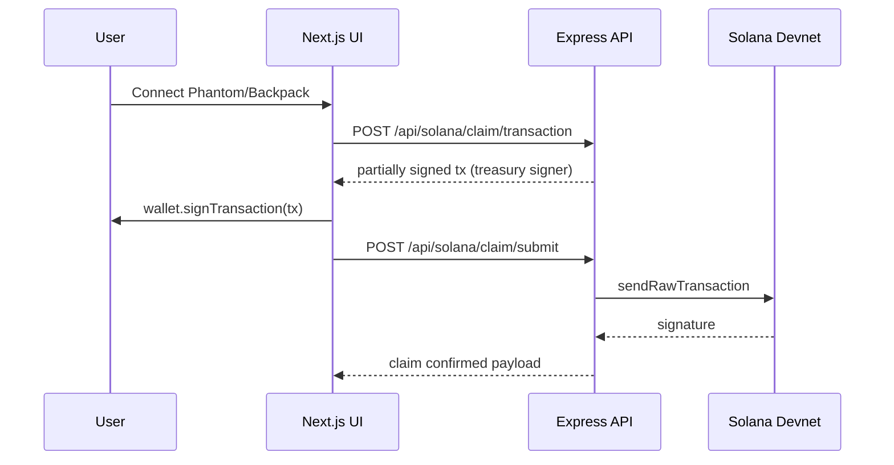

# Thermal Guilt

Thermal Guilt is a gamified smart energy app that makes HVAC waste visible, competitive, and rewarding.

Your household becomes a thermal ghost. If your usage spikes above neighborhood behavior, your ghost shifts toward red and your rank drops. Stay efficient and claim `$COOL` tokens on Solana Devnet.

## Highlights
- Competitive HVAC dashboard with score, leaderboard, streak framing, and AI coaching.
- Real wallet flow (Phantom + Backpack) with wallet-signed claim transactions.
- Real provider adapters for Auth0, Backboard, Gemini, Snowflake (toggleable), and Solana.
- Shared scoring logic package reused across API and UI.

## Tech Stack
- Frontend: Next.js 14 (App Router), TypeScript, Tailwind CSS, Framer Motion, Recharts, Solana Wallet Adapter
- Backend: Node.js, Express, TypeScript, Zod
- Auth: Auth0 (OIDC + M2M + CIBA-style path)
- AI: Backboard + Gemini 2.0 Flash
- Analytics: Snowflake (currently disabled by default)
- Chain: Solana Devnet + SPL Token (`$COOL`)
- Testing: Node test runner + Vitest integration tests

## Monorepo Structure
```txt
apps/
  web/                 # Next.js dashboard + wallet UI
  api/                 # Express API + provider adapters
packages/
  shared/              # Shared score/reward/ghost logic
infra/
  snowflake/           # SQL schemas and tasks
  solana/              # Anchor program skeleton
docs/
  TECHNICAL_BLOG.md
  social/
```

## Architecture


## Core Runtime Flow


## Important Configuration

### Required for local run
```bash
PORT=3001
NEXT_PUBLIC_API_BASE_URL=http://localhost:3001

SOLANA_RPC_URL=https://api.devnet.solana.com
NEXT_PUBLIC_SOLANA_RPC_URL=https://api.devnet.solana.com
SOLANA_PRIVATE_KEY=... # treasury keypair (base58 or JSON array)
COOL_TOKEN_MINT=...    # devnet SPL mint
PROGRAM_ID=11111111111111111111111111111111

SNOWFLAKE_ENABLED=false
```

### Auth0 (optional for early local demo)
```bash
AUTH0_DOMAIN=your-tenant.auth0.com
AUTH0_CLIENT_ID=...
AUTH0_CLIENT_SECRET=...
AUTH0_AUDIENCE=https://thermal-guilt-api
AUTH0_AI_AGENT_CLIENT_ID=...
AUTH0_AI_AGENT_CLIENT_SECRET=...
```

## Quick Start
1. Install dependencies
```bash
npm install
```

2. Create env file
```bash
cp .env.example .env
```

3. Start API
```bash
npm run dev:api
```

4. Start web app
```bash
npm run dev:web
```

5. Open [http://localhost:3000](http://localhost:3000)

## Bootstrap `$COOL` Mint (Devnet)
One-shot script to create mint + treasury ATA + initial supply:
```bash
npm --workspace @thermal-guilt/api run solana:bootstrap-mint -- --supply 10000000 --decimals 6
```

The script prints env lines to paste directly into `.env`.

## Key Code Snippets

### Shared scoring logic
```ts
// packages/shared/src/scoring.ts
export function scoreToTokenReward(score: number): number {
  if (score >= 95) return 100;
  if (score >= 85) return 50;
  if (score >= 70) return 20;
  if (score >= 50) return 5;
  return 0;
}
```

### Claim transaction builder (API)
```ts
// apps/api/src/services/solana.ts
export async function buildClaimTransaction(walletAddress: string, score: number) {
  // builds transfer tx from treasury ATA -> user ATA
  // partially signs with treasury key
  // returns base64 tx for wallet signing
}
```

### Wallet-sign flow (web)
```ts
// apps/web/components/token-card.tsx
const txPayload = await apiPost("/api/solana/claim/transaction", { walletAddress, score });
const tx = Transaction.from(Buffer.from(txPayload.serializedTransaction, "base64"));
const signed = await wallet.signTransaction(tx);
await apiPost("/api/solana/claim/submit", { signedTransaction: signed.serialize().toString("base64") });
```

## Scripts
```bash
npm run dev         # web + api
npm run dev:web
npm run dev:api
npm run test        # shared + API integration tests
npm run build
```

## Contributing

### How to fork and contribute
1. Fork this repository.
2. Clone your fork and create a branch:
```bash
git checkout -b feat/your-feature-name
```
3. Run locally and verify changes with:
```bash
npm run test
npm run build
```
4. Open a PR with a clear summary and screenshots for UI changes.

### Contribution guidelines
- Keep scoring/ranking behavior in `packages/shared`.
- Keep provider-specific logic in `apps/api/src/services/*`.
- Add integration tests for API contract changes.
- Use Devnet-only chain operations.

## Feature Ideas for Contributors
- Real thermostat integrations (ecobee/Nest) with approval flow.
- Streak NFTs and badge rendering in profile.
- Weekly neighborhood battles and challenge templates.
- Better anomaly detection with seasonal decomposition.
- Push notifications for “ghost turned red” events.
- CSV/PDF export for weekly thermal report cards.

## Current Status
- Snowflake is intentionally disabled by default (`SNOWFLAKE_ENABLED=false`).
- EIA and Mapbox are intentionally not used.
- App is runnable end-to-end with simulated energy data + real Solana claims on Devnet.
